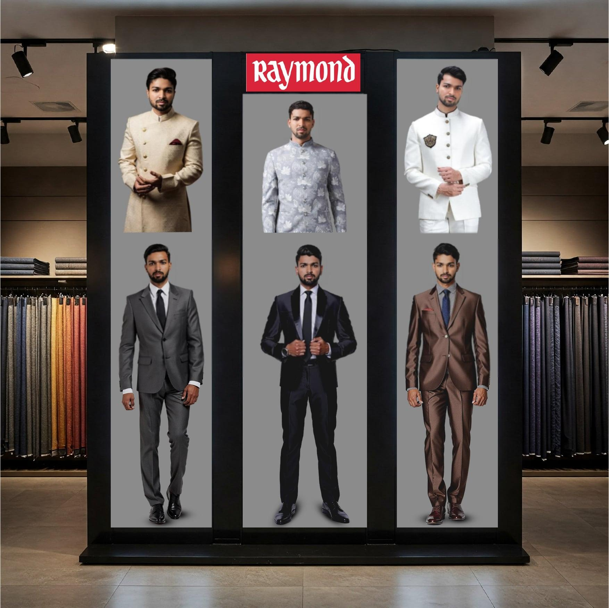

# 🧍‍♂️ Mannequin Wall — Interactive Deepfake Wall

**An interactive AI-powered mannequin display system** that lets customers visualize themselves as brand ambassadors or models by swapping their faces onto mannequins or ambassadors wearing clothing and accessories in real time..  

This system integrates a **FastAPI backend**, a **Roop-based deepfake model**, and a **Remote Slideshow System** running on a store display.

---

## 🎯 Objective

Create an engaging **in-store experience** where users:
1. Scan a **QR code** displayed near the mannequin wall.
2. Take a **selfie** using their phone.
3. Instantly see their **face swapped** onto a mannequin displayed on the digital wall.

---

## Ideation 

### Version 1 : Mannequin Wall 

#### Mannequin wall (Before) :

   

#### Input Image isn't disclosed to public

#### User Scans Qr code in the standee , redirected to our website (Demo) 


#### Mannequin Wall (After) :




### Version 2 : 


## ⚙️ Installation Guide

### 1️⃣ Clone Repository

```bash
git clone https://github.com/yourusername/mannequin-wall.git
``` 
### 2️⃣ Setup Backend

```bash
cd Backend
``` 
### Clone the Roop deepfake model:

```bash
git clone https://github.com/s0md3v/roop
``` 
### 3️⃣ Install Dependencies

💡 It’s highly recommended to use a virtual environment (venv or conda).

```bash
pip install -r requirements.txt
``` 

### 4️⃣ Run Backend Server

```bash
uvicorn main:app --reload
``` 

### 5️⃣ Setup Frontend

```bash
cd frontend
npm install
npm run dev
``` 

### 🖥️ Reference System
This project is inspired by and integrated with the 

<a href = " https://github.com/Suresh-Kumar-Nadar/Remote-Slideshow-System">Remote Slideshow System </a> —
used to display dynamic visual outputs on in-store digital screens. 


<a href = "https://github.com/s0md3v/roop">Roop </a> —
used to generate face swap for mannequin 


### Future Enchancements

Develop a comprehensive system architecture with a well-defined workflow to ensure seamless integration and scalability.


